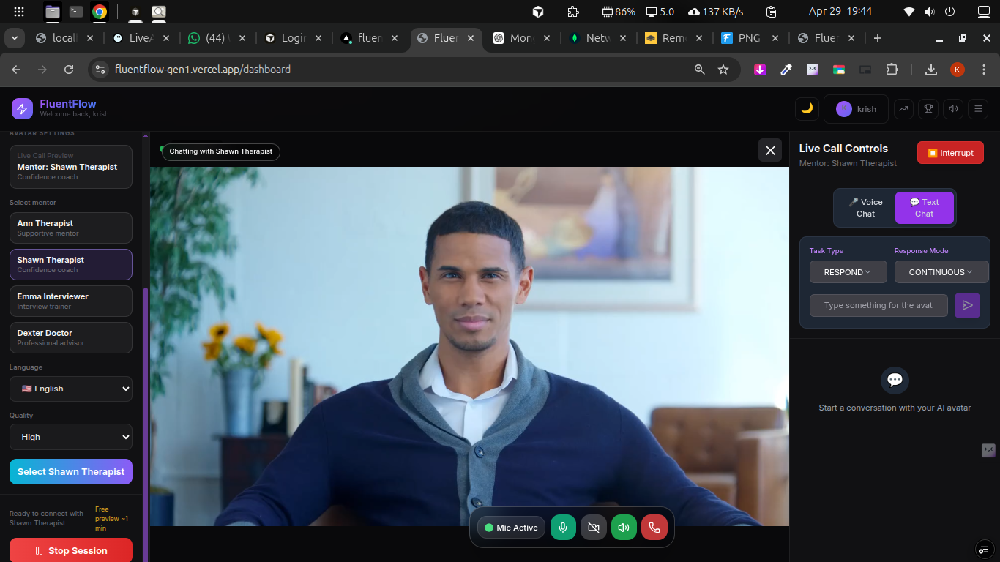

<div align="center">
  
# 🚀 FluentFlow - Premium AI Communication Coach

**Master your communication skills with lifelike AI-powered avatars and real-time feedback.**

[](https://nextjs.org/)
[](https://www.typescriptlang.org/)
[](https://tailwindcss.com/)
[](https://heygen.com/)
[](https://gemini.google.com/)

<br />




</div>

---

## ✨ What is FluentFlow?

**FluentFlow** is a revolutionary, enterprise-grade AI-powered communication coaching platform. By combining **cutting-edge streaming avatars** with **advanced conversational AI**, we provide an unparalleled environment to master communication skills. Whether you're preparing for critical job interviews, practicing high-stakes presentations, improving customer service, or simply building unshakeable confidence in everyday conversations, FluentFlow delivers an immersive, interactive, and beautifully designed learning experience.

### 🎯 Key Features

#### 🤖 Dual AI Interaction Modes
- **Avatar Chat Mode**: Real-time video conversations with lifelike, responsive AI avatars.
- **Gemini Text Chat**: Intelligent, deeply contextual text-based conversations powered by Google Gemini AI.

#### 🎭 Specialized Avatar Personalities
- 👩‍⚕️ **Ann** - Professional counseling and coaching
- 👨‍⚕️ **Shawn** - Supportive therapeutic guidance
- 💪 **Bryan** - High-energy motivational coaching
- 👨‍⚕️ **Dexter** - Medical and professional expertise
- 👩‍💻 **Elenora** - Technical and analytical discussions

#### 🌍 Global Multilingual Support
Practice and perfect your communication in multiple languages:
`🇺🇸 English` `🇪🇸 Spanish` `🇫🇷 French` `🇩🇪 German` `🇨🇳 Chinese` `🇯🇵 Japanese` `🇰🇷 Korean` `🇮🇳 Hindi`

#### 🎨 Premium Modern UI/UX
- 🌙 **Adaptive Themes**: Beautifully crafted Dark and Light modes.
- 📱 **Fully Responsive**: Seamlessly works across desktop, tablet, and mobile devices.
- ✨ **Fluid Animations**: Smooth, Framer Motion-powered micro-interactions.
- 🎯 **Intuitive Controls**: A clean, distraction-free interface designed for focus.

#### 🔊 Advanced Voice & Video Features
- 🎤 **Real-Time Voice Recognition**: Highly accurate, instant speech-to-text.
- 📹 **Low-Latency Video Streaming**: High-quality, real-time avatar video.
- 🔇 **Granular Audio Controls**: Easy-to-use audio and microphone management.
- 📸 **Picture-in-Picture**: User video overlay for self-monitoring.

---

## 🚀 Quick Start

### Prerequisites

Ensure you have the following installed and configured before proceeding:
- **Node.js** 18+ ([Download here](https://nodejs.org/))
- **npm** or **pnpm** package manager
- **HeyGen API Key** ([Get one here](https://app.heygen.com/settings))
- **Google Gemini API Key** ([Get one here](https://aistudio.google.com/app/apikey))

### Installation

1. **Clone the repository**
   ```bash
   git clone https://github.com/your-username/FluentFlow.git
   cd FluentFlow
   ```

2. **Install dependencies**
   ```bash
   npm install
   # or
   pnpm install
   ```

3. **Set up environment variables**
   Create a `.env.local` file in the root directory:
   ```env
   # Required: HeyGen API Key for avatar functionality
   HEYGEN_API_KEY=your_heygen_api_key_here

   # Optional: Google Gemini API for enhanced AI conversations
   GOOGLE_GENERATIVE_API_KEY=your_gemini_api_key_here

   # Optional: Base API URL (defaults to HeyGen production)
   NEXT_PUBLIC_BASE_API_URL=https://api.heygen.com
   ```

4. **Start the development server**
   ```bash
   npm run dev
   # or
   pnpm dev
   ```

5. **Open your browser**
   Navigate to [http://localhost:3000](http://localhost:3000) and start practicing!

---

## 🎮 How to Use

### Getting Started with Avatar Chat
1. **Choose Your Mode**: Select "Live Call with Avatar" from the beautifully designed sidebar.
2. **Configure Your Avatar**: Pick your preferred AI coach personality and language.
3. **Start Session**: Click "Start Session" to initiate the real-time stream.
4. **Practice**: Speak naturally using voice commands, or type your input.
5. **Monitor Performance**: Keep an eye on the live connection quality and real-time interaction feedback.

### Voice & Video Controls
- 🎤 **Voice Recognition**: Tap the microphone icon to begin voice input.
- 🔇 **Mute/Unmute**: Seamlessly control your audio output.
- 📹 **Video Toggle**: Show or hide your own camera feed.
- 📱 **Mobile Optimized**: Access all core controls easily on mobile devices.

---

## 🛠️ Technology Stack

<div align="center">

| Area | Technologies |
| :--- | :--- |
| **Frontend** | Next.js 15, React (App Router), TypeScript, Tailwind CSS, Framer Motion, Radix UI |
| **AI & APIs** | HeyGen Streaming Avatars, Google Gemini 2.0, Web Speech API |
| **Tooling** | ESLint, Prettier, TypeScript Compiler |

</div>

---

## 🎯 Use Cases

- **💼 Professional Development**: Job interview practice, presentation rehearsals, and customer service role-play.
- **🌍 Language Learning**: Accent training, contextual vocabulary building, and cultural communication nuances.
- **🧠 Personal Growth**: Building social confidence, active listening, and developing emotional intelligence.

---

## 🤝 Contributing

We welcome contributions! Please feel free to:

1. **Fork** the repository
2. **Create** a feature branch (`git checkout -b feature/amazing-feature`)
3. **Commit** your changes (`git commit -m 'feat: add amazing feature'`)
4. **Push** to the branch (`git push origin feature/amazing-feature`)
5. **Open** a Pull Request

---

<div align="center">
  <p><strong>Built with ❤️ for better communication worldwide</strong></p>
  <p>
    <a href="#-fluentflow---premium-ai-communication-coach">Back to Top</a> •
    <a href="https://fluentflow.ai">Website</a> •
    <a href="https://demo.fluentflow.ai">Live Demo</a>
  </p>
</div>
